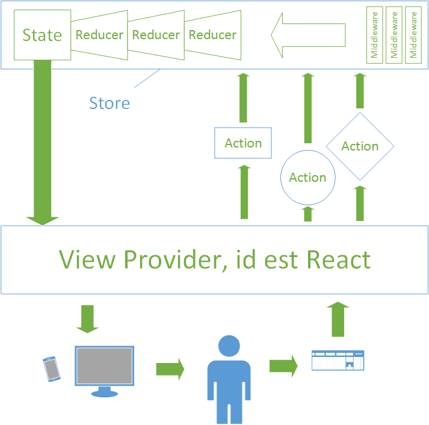
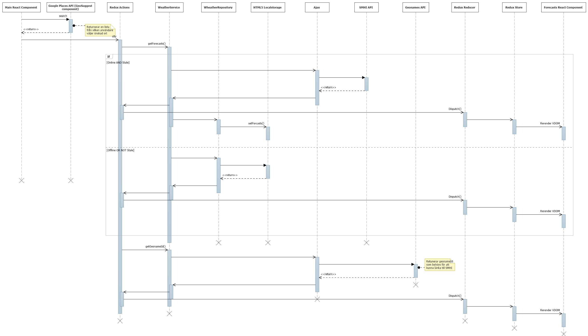

# Väderapplikation, _slutprojekt i 1dv449_

Applikationen är publicerad här; http://weather.oskarklintrot.se/

## Inledning

Tanken från början var att göra en väderapplikation som knöt an till projektet i 1dv409 som fortgick parallelt. Idén var att skapa ett eget API som detta projektet skulle konsumera. Denna idé övergavs för att kunna använda https och därmed Service Workes. Genom att använda Service Workers går det väldigt enkelt att göra applikationen körbar även offline. Testa till exempel att gå in på undertecknads applikation från [RIA-kursen](https://www.figurkoder.se/) och stänga av internet genom att använda till exempel Chrome DevTools. Det går till och med att gå in på sidan eller uppdatera sidan offline!

Problemet som uppstod var att de API:er som tänktes utnyttjas inte fungerade över https och därmed kunde inte heller applikationen använda sig av https. Dessutom tillät inte YR:s API CORS. Detta gjorde att applikationen gick från att använda Geoname API och YR API till Geoname API och SMHI API till Google Places API och SMHI API till Google Places API, Geoname API och SMHI API. Hängde ni med?

Själva applikation använde sig av just applikationen från RIA-kursen som en boilerplate för att inte behöva börja från början med applikation. Applikationerna använder sig nämligen av samma teknik, React och Redux som byggs till en minifierad JavaScript-fil och körs enbart på klientsidan och hostas hos GH-pages. Det var när applikationen publicerades och den istället för att använda sig av webpack dev server istället kördes på klientsidan som upptäckten att YR inte tillåter CORS gjordes. CSS ramverket Bootstrap har används.

## Sekvensdiagram

För att förstå hur flödet ser ut i en Redux applikation kan man titta på följande bild, lånad från ett [blogginlägg från RIA-kursen](http://2dv607.oskarklintrot.se/redux-devtools/):

Flödet är alltså enkelriktat och i applikationen används ett bibliotek för att knyta ihop React (som är motsvarande "View Provider" i bilden) med Redux. Detta biblioteket gör det dels möjligt för React-komponenterna att använda sig av Redux' actions samt Redux' store's state. När staten ändras i Redux' store uppdateras just de värdena i de React-komponenterna som prenumererar på de värdena i staten. När de ändras uppdateras React's virtual DOM som i sin tur ser till att enbart det som faktiskt har ändrats i browserns DOM uppdateras.

Nedan följer ett UML sekvensdiagram över hur det ser ut när en användare gör en lyckad förfrågan över hur vädret ser ut på en ort:

Det som kan vara värt att notera är att Geoname API enbart används, som det står i kommentaren, för att få tag i geonameId till orten. Detta id används för att kunna skapa en länk till prognosen hos SMHI. I flödet är det lätt att få intrycket att denna länk kommer att dyka upp oavsett om applikationen faktiskt lyckas hämta väderrapporten eller inte eftersom de två flöderna ser ut, och är, åtskiljda från varandra. Det finns dock en logik i komponenten som renderar väderrapporten att den inte ska rendera något om det inte gick att hämta väderrapporten. Eftersom väderrapporten är prioriterad kommer den alltid att skrivas ut om det gick att hämta vädret, även om det inte gick att hämta något geonameId. Det som händer då istället är att det skrivs ut en generell länk till SMHI:s startsida.

## Säkerhet och prestanda

### CSS först, JS sist

Sidan börjar inte renderas förrän all CSS är inläst, därför ligger all CSS redan i headern. All Javascript ligger å andra sidan sist för att tillåta att sidans html skrivs ut först för att ge en proggressiv rendering av sidan [1]. I just detta fallet är det dock mer teori än praktik eftersom applikationen är en SPA och all Javascript finns i en enda fil, vilket i praktiken innebär att den kommer ändå inte renderas proggressivt utan först när den filen är inläst.

### Minifierade filer

Alla CSS filer borde vara minifierade till en [1], vilket tyvärr inte är fallet. Detta på grund av tidsbrist till att lära mig hur det fungerar att minifiera med hjälp av webpack, som jag använder för att bygga sidan. Dock används den minifierade versionen av Bootstrap. När det gäller Javascript-filerna är allt minifierat till en enda boundle för att minska HTTP-anropen och minska storleken på filerna [1]. Dock är inte Offline.js-minifierade bibliotek inkluderat i boundlen utan ligger för sig själv. Detta eftersom Offline.js slutade fungera när den lades in som en del av boundlen *(OBS! Detta gjordes nyligen, syns det inte på http://weather.oskarklintrot.se så har inte CF cahce uppdaterats än men då syns det här; http://oskarklintrotskolarbetewp14.github.io/1dv449_project)*.

### Caching

#### Localstorage

När en användare söker efter vädret i applikation cachas responsen i browserns localstorage. Detta göra att nästa gång användaren söker efter vädret på en ort som den redan har sökt för hämtas datan istället från localstorage, vilket går snabbare samt reducerar antalet requests till SMHI:s API [1].

#### Cloudeflare

Besöker man sidan genom http://weather.oskarklintrot.se/ hämtas en cachad version från Cloudeflare från någon av deras 74 datacenter stora CDN, vilket även det gör att sidan kan laddas snabbare [1].

### Virtual DOM

React använder sig av deras så kallade Virtual DOM. Det fungerar genom att alla ändringar som görs i applikationen skrivs till deras virtuella DOM istället för browserns DOM. Sedan jämförs innehållet i den virtuella DOM:en med browserns DOM och enbart det som skiljer uppdateras. Detta går snabbare än att hela tiden uppdatera hela browserns DOM [2].

### Escaping/Sanatizing

Något som är värt att nämna kring säkerhet och React som är viktigt när det gäller att använda API:er är att React själv sköter escaping/sanatizing av datan från API:erna (och all annan data som ska renderas som inte är skrivet i JSX i själva komponenten) innan den skrivs ut till klienten [3]. Har alltså exempelvis SMHI:s API blivit hackat och någon försöker göra en XSS genom att lägga in script i deras API kommer den datan inte göra någon skada, förutom att det kommer att se märkligt ut när temperaturen istället består av Javascript kod.

### Client only

Visst finns risken att någon hackar Githubs servrar för skojs skull men då sidan enbart lever på klienten finns inte mycket att göra där. Det finns inga inloggningar, inga hemliga API-nycklar, inga credentials till någon databas. Sidan är helt enkelt väldigt tråkig för en hackare, vilket ökar säkerheten.

## Offline-first

Tappar användaren uppkopplingen kommer ett flashmessage upp om att uppkopplingen är borta samt ett varningsmeddelande i samband med den enda textboxen på sidan. Detta för att förvarna användaren om att sidan troligtvis inte kommer fungera för tillfället. Dock går det fortfarande att söka efter vädret på de orter som tidigare har besökts och som finns cachade både av Google Places Autocomplete och av denna applikationen. Dock krävs det oftast att användaren sökt minst två gånger på samma ort innan sökningen cachas. Testa gärna att gå in på applikationen och sök fram och tillbaka på några orter och sen stäng av uppkopplingen och sök på de tidigare orterna och se att vädret ändras. Tanken var att implementera en feature som växlar mellan två autocomplete, Google Places API Autocomplete och jQuery UI Autocomplete, där den förstnämna hämtar sin data från Googles servrar och den sistnämnda kopplas in ifall uppkopplingen försvinner och som istället hämtar sin data från localstorage så att användaren kan se vilka orter som går att kolla vädret för. Gamla väderrapporter rensas ut innan väderrapporter retuneras från localstorage och Offline.js används för att kontrollera i React-komponenten `Main` ifall användaren är online eller offline. Så det enda som återstod var att implementera jQuery UI Autocomplete men tyvärr räckte inte tiden till hela vägen. Tanken fanns också på att komplettera Offline.js med HTML5 AppCache för att hindra sidan från att sluta fungera om användaren exempelvis uppdaterar sidan offline men dels fanns inte tiden och dels är HTML5 AppCache redan en föråldrad teknik och egentligen inte bör användas alls [4].

## Risker

Eftersom applikationen inte hantera några känsliga datan som personuppgifter eller lösenord finns inga större risker med den. Största risken vore om någon ville öka belastningen på underliggande API:er. Dock kommer antagligen applikationen bara bli blockerad innan någon skada är skedd. Eftersom denna applikationen bara behöver överleva tills den är betygsatt är inte detta ett problem. En möjlig lösning kunde vara att sätta en liten fördröjning på varje AJAX-anrop för att minska belastningen på servern utan att användaren behöver märka något. En till lösning kan vara att sätta en begränsning på antal möjliga API-anrop under en viss tid eller sätta en fördröjning till när nästa AJAX-anrop tidigast kan skickas. Några etiska övervägande är svåra att göra kring en väderraport utan att det blir alltför krystat.

## Egna reflektioner och funderingar

Efter allt strul med API:er och HTTPS är jag just nu mest glad att ha något att visa upp och vill mest bli av med den. Dessutom hann jag inte med att implementera möjligheten att söka bland cachen, vilket jag känner var ett stort misslyckande. Till exempel hade jag kunnat struntat i att lägga tid på att implementera att hämta geonameId för att kunna länka till SMHI. Visst, det är en snygg touch men ingen lär lägga märke till det. Den tiden hade jag gärna lagt på att implementera den sista biten med att kunna söka i cachen istället. Jag var från början inställd på att göra så att applikationen fungerar offline på samma sätt som min applikation i RIA-kursen men istället blev det bara ett litet flash message. Det känns som ett stort nederlag då jag redan har implementerat service workers genom wrappern UpUp och den fanns redan implementerad i byggprocessen i den koden jag återanvände och det enda som satte stopp var att jag inte hittade ett väder API i tid som fungerade över HTTPS och som tillåter CORS. Dessutom visade sig att AppCache inte bör användas [4].

Om jag ska försöka vara lite positiv så var jag väldigt nöjd med hur smidigt det var att använda flera olika AJAX-anrop genom att använda kombination React, Redux samt Promises. I Redux' actions så anropas API:erna genom en service-klass som retunerar ett promise per API och som i sin tur antingen gör ett AJAX-anrop eller hämtar data från localstorage. När den är klar och actions får tillbaka en resolve så görs en dispatch till Redux' reducers med datan och staten uppdateras. I React-komponenterna kontrolleras sen så att all datan är komplett innan den renderas. Att kunna använda sig av fyra datakällor (Google Places API, Geoname API, SMHI API och HTML5 Localstorage) utan en enda callback känns som en dröm som blivit sann jämfört med det callback hell man kunde hamna i enbart med ett enda AJAX-anrop i ES5 och utan React och ett enkelriktat dataflöde! Dessutom var det mitt första försök med Promises så nu i efterhand är jag väldigt glad att jag tog chansen att lära mig använda Promises istället för att välja den enkla vägen med callbacks! I förra labben där jag också implementerade AJAX-anrop i en React applikation var det mer ett fulhack än något annat och dessutom använde jag inte Redux så det var intressant att skriva en ny liknande applikation fast med annan teknik. Den förra var så liten att det fungerade utan Redux men i den här applikationen var Redux till stor hjälp.

## Betygshöjande delar

Det är svårt att vara positiv kring ett projekt som man själv ser som ett misslyckande men applikationen uppfyller de punkter som nämns under "Eventuellt betygshöjande funktioner"; flera relavanta API:er används, applikationens design är responsiv och den inkluderar HTML5-relaterade API:et localstorage. Koden må vara lite stökig just nu då jag inte hunnit rensa upp ordentligt efter alla försök med API:er men å andra sidan finns en mycket bra byggprocess där olika moduler kan inkluderas beroende på om utvecklaren just utvecklar eller bygger för produktion samt så finns kod för att lätt lägga till nya moduler med nya actions och nya reducers vilket gör applikationen lätt att bygga på med nya funktioner. Koden är inte välkommenterad utan istället försöker jag skriva självkommenterande kod med beskrivande namn på variabler och funktioner.

## Inspelad presentation

## Referenser

[1] Steve Souders, _High Performance Web Sites_. Sebastopol, CA: O'Reilly, 2007.

[2] Facebook, _Advanced Performance_. 2016. Available: https://facebook.github.io/react/docs/advanced-performance.html. Accessed 15 Jan 2016

[3] Facebook, "Adding Markdown," in _Tutorial_, 2016. Available: http://facebook.github.io/react/docs/tutorial.html#adding-markdown. Accessed 15 Jan 2016

[4] Mozilla Developer Network, _Using the application cache_. 2015. Available: https://developer.mozilla.org/en-US/docs/Web/HTML/Using_the_application_cache. Accessed 15 Jan 2016
